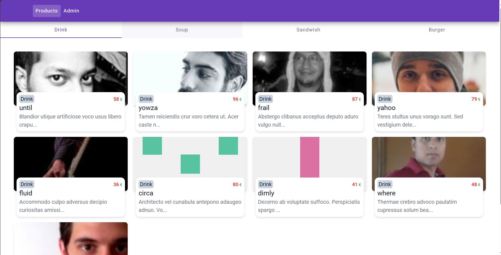
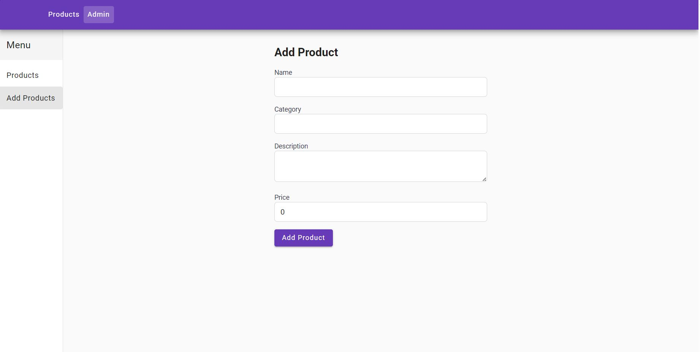
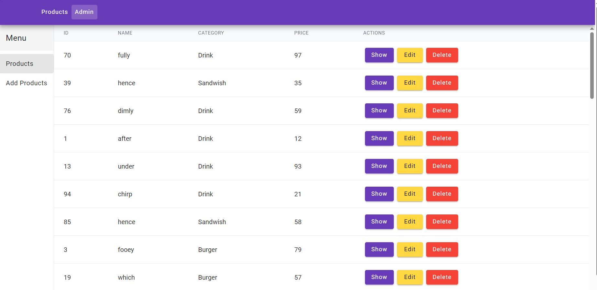

<!DOCTYPE html>
<html lang="en">
<head>
    <meta charset="UTF-8">
    <meta name="viewport" content="width=device-width, initial-scale=1.0">
    <meta name="description" content="This project demonstrates using NgRx to manage product-related actions such as adding, editing, updating, and deleting products. It includes a frontend built with Angular, Angular Material, Tailwind CSS, and NgRx, with a backend powered by JSON Server.">
    <meta name="keywords" content="Angular, NgRx, Angular Material, Tailwind CSS, JSON Server, CRUD, Product Management">
<title>Angular NgRx Products</title>
</head>
<body>

  # Angular NgRx Products

 This project demonstrates using NgRx to manage product-related actions such as adding, editing, updating, and deleting products. It includes a frontend built with Angular, Angular Material, Tailwind CSS, and NgRx, with a backend powered by JSON Server.

  ## Usage

  ### Product Management

  The application allows you to manage products, including adding, editing, and deleting products. Products are displayed in a list format with a tab bar to filter products by category.
  ### Admin Page

  The admin page provides functionality for administrators to manage products, including adding new products, editing existing ones, and deleting products.

   ## Features

  - **Product Management**: Administrators can add, edit, update, and delete products.
  - **Dynamic Display**: Products are dynamically displayed based on their categories.
  - **Shared Components**: Includes shared components like buttons, dialogs, and pipes for consistent UI elements across the application.
  - **Angular Material**: Utilized for UI components such as buttons, dialogs, navbar, and tabs.
  - **Tailwind CSS**: Used for styling to create a responsive and visually appealing UI.
  - **NgRx**: State management using NgRx, including actions, effects, reducers, and selectors.
  - **Faker**: Used to generate dummy data for demonstration purposes.

  ## Technologies Used

  - Angular
  - Angular Material
  - Tailwind CSS
  - NgRx
  - RxJS
  - Faker
  - JSON Server

    ## Screenshots

    ### Product List
    The product list page displays all products, categorized by tabs for easy navigation.

    

    ### Admin Page
    The admin page allows administrators to add new products, edit existing products, delete products, and view product details.

    
    

    ## Getting Started

    To get started with this project, follow these steps:

    1. **Clone the repository**:
        ```bash
     git clone https://github.com/yarob-alrifai/angular-ngrx-products.git
        cd angular-ngrx-products
        ```

    2. **Install dependencies**:
        ```bash
     npm install
        ```

    3. **Generate dummy data**:
        ```bash
     npm run generate
        ```

    4. **Start the JSON Server backend**:
        ```bash
     npm run server
        ```

    5. **Start the Angular frontend**:
        ```bash
      npm start
        ```

6. **Open your browser and navigate to** `http://localhost:4200`

    ## Project Structure

    - **store/**: Contains the NgRx state management files including actions, effects, reducers, and selectors for products.
    - **shared/**: Contains shared components, dialogs, and pipes used across the application.
    - **services/**: Contains the service used to connect to the JSON server and manage product data.
    - **components/**: Contains Angular components for product display and administration.

    ## Folder Structure

    - **src/app/shared**: Contains shared components, pipes, and modules used across the application.
    - **src/app/services**: Contains services for interacting with the backend.
    - **src/app/store**: Contains NgRx state management setup, including actions, effects, reducers, and selectors.

    ## Scripts

    - `npm start`: Starts the Angular development server.
    - `npm run build`: Builds the Angular application.
    - `npm run test`: Runs tests.
    - `npm run generate`: Generates dummy data using Faker.
    - `npm run server`: Starts the JSON Server backend.
    - `npm run dev`: Runs both the JSON Server backend and Angular development server concurrently.

    ## Additional Notes

    - **NgRx**: Used for managing the state of products, including actions for fetching, adding, updating, and deleting products.
    - **Angular Material**: Provides a rich set of UI components for a consistent look and feel.
    - **Tailwind CSS**: Utility-first CSS framework for rapid UI development.
    - **JSON Server**: Simple backend for prototyping and development purposes.
    - **Faker**: Generates dummy data for the product list.

    ## License

    This project is licensed under the MIT License - see the [LICENSE](LICENSE) file for details.

    ## Contributing

    We welcome contributions from the community. Please see the [CONTRIBUTING](CONTRIBUTING.md) file for more details.

   
